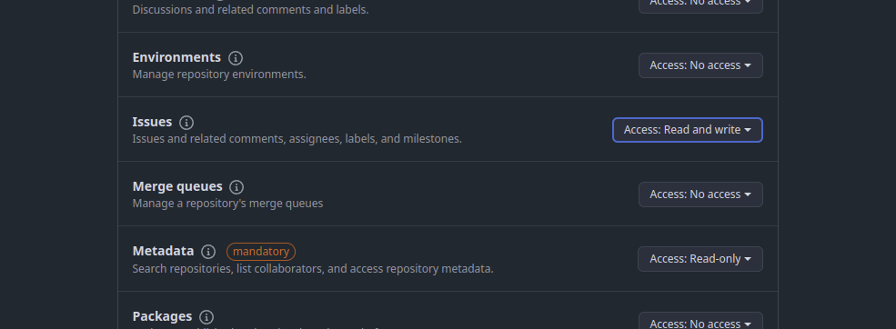
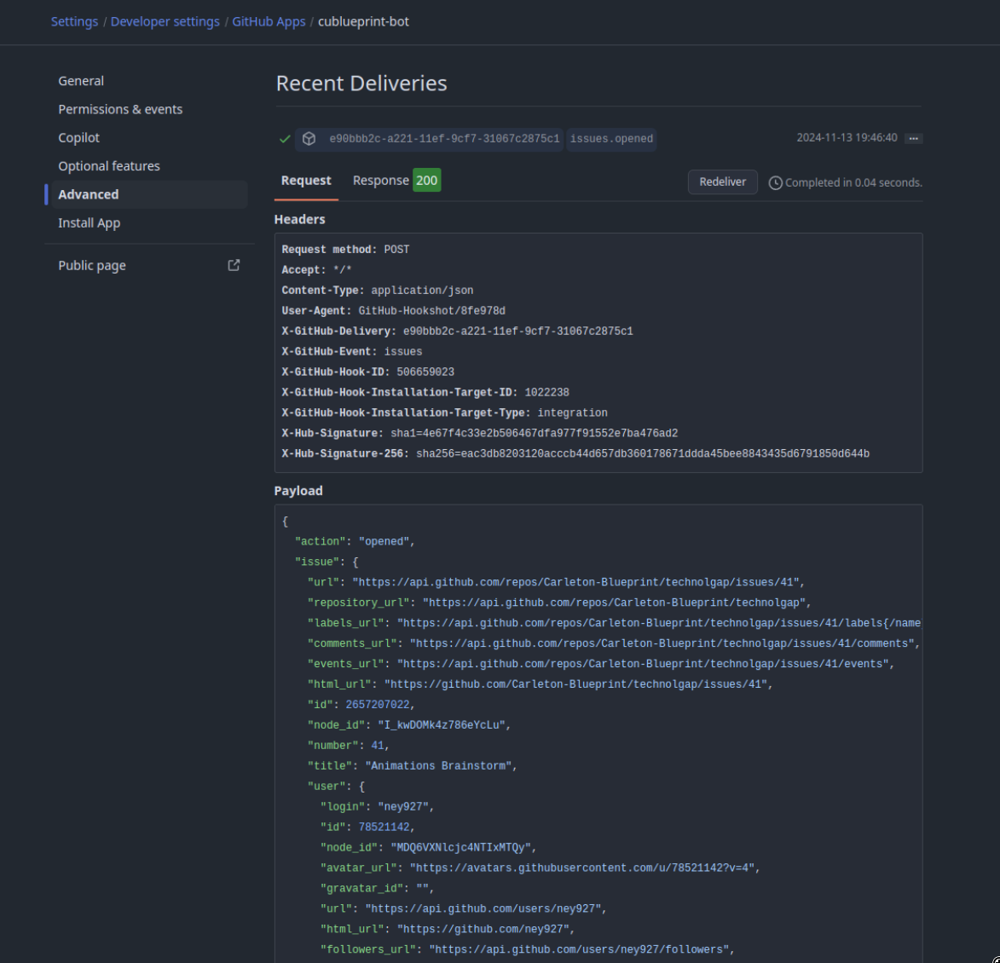
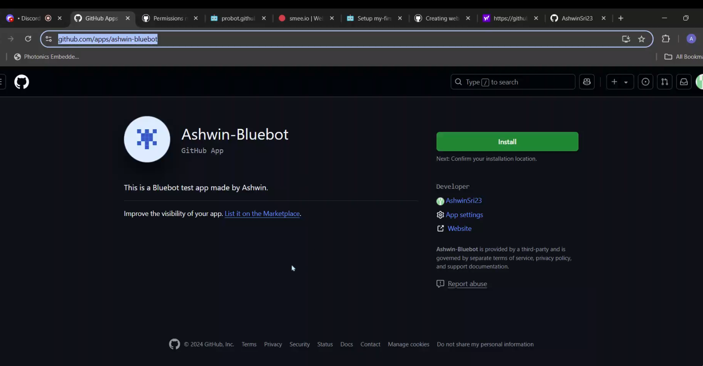

## 1. Probot

Bluebot is bootstrapped with [Probot](https://probot.github.io/). As such, you will need to configure Probot to be able to communicate with your GitHub app integration.

Luckily, there is a really comprehensive guide on how to do this:

- [https://probot.github.io/docs/development/#manually-configuring-a-github-app](https://probot.github.io/docs/development/#manually-configuring-a-github-app)

For the most part, you will be creating and linking a GitHub App to your Bluebot instance. This will allow Bluebot to interact with your repositories and projects on behalf of your GitHub App.

**^^Most importantly, follow the guide and populate your `.env` file with the necessary credentials.^^**

## 2. GitHub App

If you've completed the guide above, you should already have a GitHub App set up. If not, please do that first.

GitHub Apps are subjected to fine-grained permissions, and you can configure them to have access to specific repositories and projects. This is important because you don't want Bluebot to have access to all your repositories and events.

At this time, Bluebot only requires permissions to **read and write to issues**. Go to your GitHub App settings and configure the permissions as shown below:



### Verifying and Debugging {#verifying}

There is a very helpful GitHub panel that you can use to verify that the events you are interested in is indeed getting sent to the webhook server your app is configured to use. This panel is located in your GitHub User Settings / Developer Settings / GitHub Apps / → Click "Edit" on the App → Advanced.

This panel can also be used to obtain the full payload body of the events that are being sent to your webhook server. This is very useful for debugging and development purposes.




## 3. Installing the GitHub App on your repository

In order for you to start using Bluebot, you will need to install it on your repository. This is done by going to the GitHub App settings → "Public page" → "Install" → Select the repositories you want to install Bluebot on.



## 4. Configuring Bluebot

At this time, Bluebot does not yet have a guided configuration process. You will need to go into the `./src/constants.ts` file and set the `LABEL_ID` and `PROJECT_URL` constants.

```typescript
export const ACTIVATION_LABEL_ID = 7750572746;
export const PROJECT_URL = 'https://github.com/orgs/Carleton-Blueprint/projects/14/views/1?sliceBy%5BcolumnId%5D=Milestone';
```

`ACTIVATION_LABEL_ID`

:   - In order to not respond to every single issue event, `ACTIVATION_LABEL_ID` is used to filter events and trigger Bluebot's workflow only on issues with this label.
    - Find the label ID of your target label by using the [GitHub Debug Panel](#verifying).
    - You can configure your "New Issue" template to **automatically add this label to new issues**. See [^^this example^^](https://github.com/Carleton-Blueprint/.github/blob/main/.github/ISSUE_TEMPLATE/3-new-project.yml?plain=1). *Make sure to create a repository-level override instead of putting this in the global `.github` repository.*
    

`PROJECT_URL`

:   - This is the URL of the project board that Bluebot will be interacting with. ^^Bluebot **does not** interact with this project board directly^^ (GitHub's current API does not yet support project interactions), but it uses this URL to generate links to the project board in the comments it makes on issues.
    - You can configure a [GitHub automation](https://docs.github.com/en/issues/planning-and-tracking-with-projects/automating-your-project/adding-items-automatically) to automatically add your new issues to this project.
